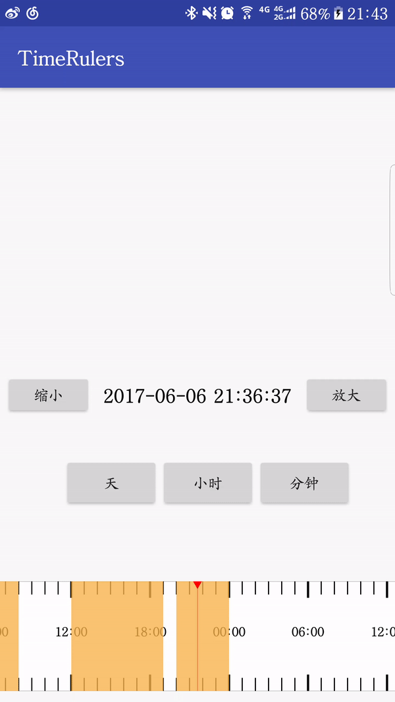

# TimeRulers

======
 一个可以缩放的时间轴

 

 Usage
 -----
 1.在xml布局中引入：
```
  <timerulers.yongxiang.com.timerulerslib.views.TimebarView
             android:id="@+id/my_timebar_view"
             android:layout_width="match_parent"
             android:layout_height="100dp"
             android:layout_alignParentBottom="true"
             android:layout_gravity="bottom"
             android:layout_marginBottom="10dp"
             android:background="#ffffff" />
```

 - 目前支持的自定义属性：
  * `middleCursorColor` 时间尺中间刻度条颜色
  - `recordTextColor` 时间刻度文字颜色
  - `recordBackgroundColor` 含有录像背景颜色
  - `timebarColor` 含有时间尺边框及刻度条颜色


 - 刻度条移动监听
 ```
 mTimebarView.setOnBarMoveListener(new TimebarView.OnBarMoveListener() {
            @Override
            public void onBarMove(long screenLeftTime, long screenRightTime, long currentTime) {
                if (currentTime == -1) {
                    Toast.makeText(MainActivity.this, "当前时刻没有录像", Toast.LENGTH_SHORT).show();
                }
                currentTimeTextView.setText(zeroTimeFormat.format(currentTime));
            }

            @Override
            public void OnBarMoveFinish(long screenLeftTime, long screenRightTime, long currentTime) {
                currentTimeTextView.setText(zeroTimeFormat.format(currentTime));
            }
        });

        mTimebarView.setOnBarScaledListener(new TimebarView.OnBarScaledListener() {
            @Override
            public void onOnBarScaledMode(int mode) {
                Log.d(TAG, "onOnBarScaledMode()" + mode);
            }

            @Override
            public void onBarScaled(long screenLeftTime, long screenRightTime, long currentTime) {
                currentTimeTextView.setText(zeroTimeFormat.format(currentTime));
                Log.d(TAG, "onBarScaled()");
            }

            @Override
            public void onBarScaleFinish(long screenLeftTime, long screenRightTime, long currentTime) {
                Log.d(TAG, "onBarScaleFinish()");
            }
        });

    }
 ```

 - 刻度条缩放监听
  ```
         mTimebarView.setOnBarScaledListener(new TimebarView.OnBarScaledListener() {
             @Override
             public void onOnBarScaledMode(int mode) {
                 返回缩放级别
                 Log.d(TAG, "onOnBarScaledMode()" + mode);
             }

             @Override
             public void onBarScaled(long screenLeftTime, long screenRightTime, long currentTime) {
                 currentTimeTextView.setText(zeroTimeFormat.format(currentTime));
                 Log.d(TAG, "onBarScaled()");
             }

             @Override
             public void onBarScaleFinish(long screenLeftTime, long screenRightTime, long currentTime) {
                 Log.d(TAG, "onBarScaleFinish()");
             }
         });

     }
  ```

  Download
  ----
  Gradle：
  ```
  allprojects {
  		repositories {
  			 maven { url 'https://dl.bintray.com/dingyongxiang/maven/' }
  		}
  }

  dependencies {
      compile 'com.dingyongxiang.library:timebarview:1.9'
  }
  ```
